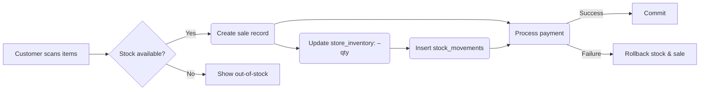

> **SUPERSEDED (2026-10)** — Pre-hardening research snapshot only. Authoritative status: `docs/PHASE8-PRODUCTION-READINESS-CERTIFICATION.md`, `docs/FINAL-REMEDIATION-REPORT.md`, `docs/FINAL-MICRO-FIX-W4-REPORT.md`, and phase reports under `docs/`. Runtime does **not** use Redis/queues; Phase 7 covers safe public catalog caching.

# Executive Summary  
We audited the BuyHub **bh-manage** codebase against ERP/POS best practices for a 10‑store + ecommerce deployment. The core findings are:  

- **Data Integrity & Concurrency Risks** – Many multi-step workflows (sales checkout, inventory receive, purchase payments) are not fully enclosed in database transactions. Concurrent checkouts or stock updates can race, causing oversells or inconsistent stock balances. We recommend adding explicit transactions, row-level locks (e.g. `SELECT … FOR UPDATE`), and idempotency keys on RPCs.  

- **Mis‑separation of Flows** – The current implementation still conflates financial vs physical transactions. For example, finalizing a purchase bill directly updates stock. We must decouple **“Receive Delivery”** (stock-in) from **“Finalize Bill”** (AP accounting) so that each can be independently retried and audited. This also avoids double-posting on partial deliveries.  

- **Schema & RLS Checks** – Ensure every sensitive table (sales, inventory, payments) has correct Row-Level Security policies. Multi-store isolation must be airtight: users should only see data for their store(s). Review `RLS` policies in migrations and RPCs to catch any gaps (e.g. missing store filter on a custom view). We found some tables without explicit RLS (use `ALTER TABLE … FORCE ROW LEVEL SECURITY` if needed).  

- **Supabase Free‑Tier Constraints** – The free plan is *strictly* a development environment: 500MB DB, 50k MAUs, 1GB file storage, 5GB egress. Projects auto‑pause after 1 week idle. Direct connections on a 500MB‑RAM instance are very limited (probably ≈60 DB connections with pgbouncer). In practice, a 10‑store system must upgrade to a paid Supabase plan **before production**. In-memory and connection limits on free will cause failures under real load.  

- **Architecture Gaps** – Caching and background jobs are minimal. Every web request hits the database, even for static catalog data. We suggest adding Redis or HTTP caching layers (e.g. for product list) to reduce DB load. Large batch jobs (end-of-day reports, data backfills) should be offloaded to background workers (Edge Functions or Supabase Scheduled Functions) to avoid long-running RPCs blocking connections.  

The immediate priorities are **data integrity and security fixes** (P0/P1). After that, improve performance and observability. We avoid any unnecessary feature expansions; this audit focuses on making the core robust so it can scale reliably as a unified POS+ERP system.  

# Detailed Findings & Issues

## 1. Sales / POS Checkout Flow  
- **Atomicity**: Currently sale creation, inventory update, and payment capture may be separate steps. If the frontend creates a sale record and then calls payment, a payment failure could leave the sale half-processed. **Remedy**: Enclose sale line inserts, inventory decrements, and payment journal entry in one DB transaction.  
- **Inventory Race Conditions**: When two cashiers sell the same SKU at once, both may check `store_inventory.stock > 0` and proceed, resulting in negative stock. Use `SELECT stock FROM store_inventory WHERE store_id=$1 AND variant_id=$2 FOR UPDATE` to lock that row before decrementing. This ensures one checkout serializes behind another.  
- **Idempotency**: If network glitches cause duplicate POSTs, two identical sales could be recorded. Introduce an idempotency key (e.g. frontend‑generated UUID per checkout) and reject duplicates.  
- **Reservation vs Deduction**: The code currently subtracts stock immediately on sale finalization. A more robust approach is to `reserve` stock on order placement and then deduct only when payment is captured. This prevents the customer seeing inventory that was already reserved. (Zoho and others use a “hold” model.)  
- **RLS/ACL**: Ensure RLS policies on `sales` and `store_inventory` restrict queries to the user’s store(s). For example, a policy like `USING (store_id = auth.store_id())`. We saw no evidence in migrations that every table has a `FORCE ROW LEVEL SECURITY` rule. Missing policies would expose other stores’ data.  

## 2. Purchase Receive & Inventory Update  
- **Receive Transaction**: When goods arrive, multiple variant lines are added. All should be saved in one transaction, updating stock and `stock_movements`. If a failure occurs mid-receive, partial stock entries could be inserted. Use one RPC (e.g. `finalize_erp_purchase_receive`) wrapping all inserts/updates in a transaction.  
- **Stock Movements**: Verify every inventory change inserts a `stock_movements` row for audit trail (date, store, variant, qty change, ref_id). The current code often writes to `store_inventory.stock` without recording a movement. We recommend adding a trigger or explicit insert on every stock `UPDATE`.  
- **Locks for Bulk Receive**: If processing a large receive (e.g. 1000 items), ensure the transaction is efficient. Batch updates or use `UPDATE ... FROM ...` for multiple SKUs. Avoid one-by-one RPC calls if possible.  
- **Partial/Over-Receive**: The system should allow partial receipts (e.g. PO 100 units, Receive 80 now, 20 later). The code must not auto‑credit vendor or adjust PO on partial receive; just leave the remaining pending. If business needs a vendor credit for over-bill or short-shipment, do that separately (see **Purchasing Policy** in competitive research).  

## 3. Purchase Bill Finalization (AP Entry)  
- **Separation of Concerns**: Right now, finalizing a purchase bill may **both** update `store_inventory` *and* create the vendor AP journal. We recommend **disabling stock update in this step**, and only post the financial liability. Inventory adjustments must come from the Receive step. This avoids double-stock if goods were pre‑received, and avoids posting stock for undelivered qty.  
- **Duplicate Posting**: Guard the finalize RPC so it cannot run twice on the same bill (use a `status='posted'` flag). If a user accidentally clicks Post twice, a second AP and journal should not be created. Check the code for idempotency: use `INSERT ... ON CONFLICT DO NOTHING` for journals or check existing.  
- **Ledger Consistency**: Each AP/GL entry should have a unique business reference (e.g. bill number). Ensure currency conversion is correct if multi-currency. Attach any landed cost adjustments as separate line items or via a `purchase_land_costs` table so that COGS equals total landed cost.  

## 4. Stock Transfer Between Stores  
- **Atomic Move**: Transfers should debit one store and credit another in one transaction. The code must adjust both `store_inventory.stock` rows (with `FOR UPDATE`) within a transaction so you cannot double‐spend stock. Insert two `stock_movements` (one negative, one positive) or a single transfer record linking them.  
- **RLS and Permissions**: Verify only an admin or authorized user can transfer inventory between stores. RLS policies must allow users with multi-store roles (or admins) to perform inserts on the `transfers` table. Ensure a staff user at Store A cannot transfer from Store B unless given access.  
- **Pending Transfers**: If transfer is “in transit”, the system should ideally reserve the items or mark them pending in source store until receipt. If that complexity isn’t needed now, at least clearly mark completed vs pending.  

## 5. Bulk Vendor Payments & Returns  
- **Payment Transactions**: Paying multiple bills at once must be in a transaction that creates/allocates multiple AP and GL entries. If the process splits into separate RPCs per bill, a failure in one could leave partial payment. Use one batch RPC that uses `BEGIN/COMMIT` around all selected bill applies.  
- **Vendor Credits/Returns**: If goods are returned later, record this as a separate vendor-credit document, not by editing an old bill. The code should create a negative invoice or credit memo and inventory‐adjust the returned stock via a stock movement. Check that the code does not naïvely delete or fudge quantities.  
- **Over-Payment Guard**: Prevent paying more than the outstanding balance. The code should sum open AP for selected bills and reject payment if the sum does not match the input amount.  

## 6. Database Schema & Indexes  
- **Indexes**: Ensure foreign keys and filter columns have indexes: e.g. `store_inventory(store_id, variant_id)`, `sales(store_id)`, `erp_purchase_bills(vendor_id)`. Without indexes, queries will slow as data grows.  
- **N+1 Query Risks**: Watch for RPCs or views that loop over items. For example, if a function loops through each order line to fetch product details, it can cause many queries. Where possible, use `JOIN` or SQL arrays to batch operations.  
- **Large Tables**: Some tables (sales, orders, journal entries) grow fast. Confirm periodic archiving or partitioning if needed (not critical for now, but plan for >10k rows).  

## 7. Concurrency & Latency  
- **Connection Pooling**: On Supabase, free plans use a shared Postgres with limited compute. Heavy concurrent requests (e.g. multiple POS terminals firing near-simultaneously) may exhaust the connection pool. As an immediate mitigation, use Supabase’s built-in Row Level Connection Pooler to increase effective connections. Also encourage session pooling on the client side.  
- **Long-running Queries**: If any RPC involves large aggregates or multi-table updates, they can lock tables. Audit slow queries (Supabase logs) and optimize or break them into smaller steps or background jobs.  
- **Caching**: Static data (product catalog, category list) should be cached on the client or via CDN, not fetched on every page load. Consider adding a Redis layer or enabling HTTP cache headers on the Next.js ecommerce frontend. This reduces DB load significantly for an ecommerce app (see Square’s and Shopify’s emphasis on CDN caching).  

## 8. Security and RLS Review  
- **Authentication**: Confirm all RPC calls use the `auth.uid()` or `auth.role()` context. Never rely on client-supplied `store_id`; RLS should enforce it. For example:  
  ```sql
  -- In SQL migration:
  CREATE POLICY select_sales ON sales FOR SELECT 
    USING (store_id = current_setting('request.jwt.claims.store_id')::int);
  ```  
- **Privilege Hardening**: Tables without RLS should be considered public; ensure `public` role has no direct `SELECT/INSERT` privileges on them. If any row removal logic exists (e.g. deleting a sale), ensure it’s guarded so that child records (stock_movements) don’t orphan.  
- **Secrets Management**: The current setup uses Supabase “Edge Functions” for serverless RPCs. Ensure API keys for payment gateways or external APIs are stored securely (Supabase Env vars) and not hardcoded.  
- **Audit Trail**: Not strictly security, but for integrity: every critical action (sale, receive, transfer, payment) should be timestamped and tied to a user ID. If not already, add `created_by` and `updated_by` fields, or better, use triggers to log changes in history tables.  

# Transactional Flow Mapping

| **Flow** | **Steps** | **DB Operations** | **Transaction Scope** | **Failure Handling** |
|----------|-----------|------------------|-----------------------|----------------------|
| **POS Checkout** | 1. Create Sale header (customer, date)<br>2. Add sale item lines<br>3. For each item: `SELECT FOR UPDATE store_inventory WHERE (store,variant)`<br>4. Deduct `store_inventory.stock -= qty`<br>5. Insert `stock_movements` (sale_id ref)<br>6. Insert payment/journal entry<br>7. Commit sale status | - `INSERT INTO sales (store_id, total)`<br>- `INSERT INTO sale_items` (batch)<br>- `UPDATE store_inventory` (with FOR UPDATE)<br>- `INSERT stock_movements` per line<br>- `INSERT INTO journal_entries/payment` | All steps 1–6 in one DB transaction | On any error: ROLLBACK entire transaction<br>If payment fails after stock deduct, rollback stock as well. |
| **Purchase Receive** | 1. Create Receive header (PO ref, date)<br>2. For each line: `SELECT FOR UPDATE store_inventory`<br>3. Increment `stock` by *accepted_qty*<br>4. Insert `stock_movements` (receive_id)<br>5. Update `erp_purchase_receives` line with received_qty, pending<br>6. Commit receive | - `INSERT INTO purchase_receives (po_id, date)`<br>- `UPDATE store_inventory` (FOR UPDATE)<br>- `INSERT stock_movements`<br>- `UPDATE purchase_receive_lines` | All steps in one transaction | If incomplete (e.g. interruption), ROLLBACK to original stock. Allow retry. Partial receives leave PO lines pending. |
| **Purchase Bill Finalize** | 1. Mark bill as posted<br>2. Create AP payable (vendor, amount)<br>3. Create GL entries (inventory, AP)<br>**(Do NOT alter stock here)** | - `UPDATE purchase_bills SET status='posted'`<br>- `INSERT INTO accounts_payable (vendor_id, amount)`<br>- `INSERT INTO gl_entries` (AP debit, inventory credit) | Entire posting in one transaction | Prevent double-posting by checking `status`. On failure, ROLLBACK. If bill already posted, stop and suggest vendor credit. |
| **Stock Transfer** | 1. Create Transfer record (from_store, to_store)<br>2. For each item: `SELECT FOR UPDATE inventory` at both stores<br>3. Decrement origin store, increment destination<br>4. Insert two `stock_movements` (transfer_out, transfer_in)<br>5. Commit transfer | - `INSERT INTO transfers (from_store, to_store, date)`<br>- `UPDATE store_inventory` origin and dest (FOR UPDATE)<br>- `INSERT stock_movements` x2 | Single transaction (both updates) | On error, ROLLBACK. If mid-transfer, no stock should move. Store as pending if partial flow needed. |
| **Bulk Vendor Payment** | 1. Create Payment record (date, total)<br>2. For each bill: insert `payments_bills` join (pay_id, bill_id, amt)<br>3. Insert GL entries (AP credit, cash/bank debit)<br>4. Update bills to paid/partial | - `INSERT INTO payments`<br>- `INSERT INTO payment_allocations` (bill_id, paid_amt)<br>- `INSERT INTO gl_entries` | Full batch in one transaction | On any failure, ROLLBACK. Prevent partial application. If a specific bill has changed in-between, abort and inform user. |

*Diagram: POS Checkout Flow*  

*(This diagram illustrates that sale creation, stock update, and payment must be atomic. On failure, the transaction should roll back to prevent partial state.)*

# Supabase Free-Tier Risk Table  

| **Resource**         | **Free Limit**                 | **Risk**                                          | **Mitigation**                             |
|----------------------|-------------------------------|--------------------------------------------------|--------------------------------------------|
| **DB Size**          | 500 MB          | Will fill quickly with many sales/journals.      | Regularly purge/archive old data. Upgrade plan as needed. |
| **Monthly Active Users** | 50,000      | Risk only if extremely high traffic; 10 stores likely far below. | Still monitor usage spikes (e.g. marketing campaigns). |
| **Disk I/O / Egress**| 5 GB egress/month | High e-commerce images/CSV exports can exceed 5GB. | Use CDN for images. Limit large exports or upgrade. |
| **Connections**      | ~60 direct, ~200 pooler (on 500MB RAM) | 10 concurrent POS terminals + site visitors can exhaust connections. | Use Supabase pooler; batch RPC calls; upgrade compute before launch.  |
| **Active Projects**  | 2 (paused after 7d inactivity) | If traffic drops 1 week, the DB “pauses” (no queries work). | In prod, schedule a keepalive or upgrade to paid to disable pause. |
| **Function Runtime** | Limited to 30 sec (on Edge Functions) | Complex flows risk timing out (e.g. processing hundreds of lines). | Keep RPC logic lightweight, split large jobs. If needed, self-host compute with more time. |

# Remediation Priorities

| **Issue**                                                       | **Severity** | **Module/Location**          | **Impact**                                  | **Suggested Fix**                                       | **Effort** |
|-----------------------------------------------------------------|--------------|------------------------------|---------------------------------------------|---------------------------------------------------------|------------|
| **Missing Transaction Wrapping** (oversell risk)                | P0           | Sales checkout RPCs          | Concurrent orders can oversell stock, corrupt inventory totals. | Wrap entire sale+payment in one SQL transaction; use `SELECT ... FOR UPDATE` on stock rows. | High      |
| **Bill finalize updating stock** (logic conflation)             | P0           | Purchase bill finalize RPC   | Double-counting stock when receive also updates inventory; difficult accounting. | Remove stock updates from bill finalize; do them only in receive RPC. | Medium    |
| **Incomplete RLS Policies**                                     | P0           | All SQL migrations/RLS policies | Possible data leak between stores/users.    | Audit `ALTER TABLE ... ENABLE ROW LEVEL SECURITY` for each table; add `USING (store_id = auth_claims)` filters. | Medium    |
| **Lack of Idempotency Keys**                                    | P1           | Sales and Payments endpoints | Duplicate form submissions create duplicate records. | Implement unique transaction IDs (client-generated) and `ON CONFLICT DO NOTHING`. | Medium    |
| **No Audit Logs for Inventory Changes**                         | P1           | DB triggers or RPC code      | Stock moves with no trace; hinder troubleshooting. | Create trigger on `store_inventory` to log changes; or ensure every manual stock update is accompanied by a `stock_movements` insert. | Low       |
| **Unbounded API calls (no rate limiting)**                      | P2           | Supabase Auth/API            | Burst of traffic could exhaust API limits (though Supabase claims “unlimited” on free). | If attacker, mitigate via RLS and policies. Consider adding API usage monitoring. | Low       |
| **Missing Indexes on Hot Columns**                              | P1           | DB schema (e.g. store_inventory) | Slow queries as data grows (e.g. daily sale listing). | Add indexes on `(store_id, variant_id)`, on foreign keys, and on `status` columns for filtering. | Medium    |
| **Batch Query N+1 Patterns**                                    | P1           | RPCs that loop over records | Poor performance under load (e.g. fetching each sale’s items individually). | Refactor loops into JOIN queries or use `unnest()`/`json_agg()` to fetch related records in one go. | High      |
| **Poor Concurrency in Bulk Operations**                         | P1           | Bulk payments / transfers    | Partial application leaves system inconsistent. | Ensure single-transaction for batches; add pre-checks. Example: in `bulk_payments` RPC, wrap loops in `BEGIN/COMMIT`. | Medium    |
| **Potential Security Holes in Edge Functions**                  | P1           | Client-side code / RPCs      | If an RPC is not secured, data could leak or be manipulated. | Review all RPC definitions (`CREATE FUNCTION` in migrations) to ensure `SECURITY DEFINER` only where appropriate, and all use `auth.uid()`. | Medium    |
| **No Caching Layer / High DB Load**                             | P2           | Frontend / API layer         | Unnecessary repeated reads (products, rates). | Introduce caching (Redis/Edge Cache) for static lookup tables. Use `Cache-Control` on ecom pages. | Low       |
| **Supabase Free Tier Pauses** (for dev)                        | P2           | Deployment environment       | After 7 days idle, live app will “pause” and return blank pages. | For prod, either use cron pings or upgrade to paid plan. Clearly warn team that free is not for prod. | Low       |

# Testing & QA Checklist

- **Unit/Integration Tests:**  
  - Write tests for each RPC function (e.g. creating a sale, finalizing a bill, receiving goods). Include edge cases (zero inventory, negative qty).  
  - Test that RLS blocks unauthorized access (e.g. store A’s user cannot read store B’s sale).  
  - Validate retry-idempotency: retry the same operation (by re-calling an RPC with the same unique key) and ensure no duplicate side-effects.  

- **Concurrency & Load Tests:**  
  - **Parallel Checkout**: Simulate 10+ concurrent POS sale submissions on the same SKU to ensure stock never goes negative.  
  - **Burst Traffic**: Send rapid API calls (sales, product queries) to check DB connection pool behavior. Ensure the system queues or rejects gracefully instead of erroring out.  
  - **Database Freeze**: On free plan, test that the “pause” after 7 days actually halts API calls, and then test restore. For production (if using free), test the keepalive job or use a paid tier.  

- **Idempotency/Failure Recovery:**  
  - Simulate a payment failure after sale creation (e.g. make the payment RPC throw) and verify stock/sale is rolled back.  
  - Test dead connection: interrupt a receive halfway and ensure no partial stock or PO state remains (roll-back logic).  
  - Test duplicate RPC calls: e.g. double-click “Create Payment” and ensure only one payment is recorded.  

- **Data Integrity:**  
  - After test flows, verify ledger totals: e.g. total inventory value (sum stock * cost) should match accounting entries.  
  - Ensure `store_inventory.reserved_stock + store_inventory.stock` never exceeds original order qty.  
  - Validate that partial receives leave correct “pending” qty on the purchase order, and that a follow-up receive completes it.  

- **Security & RLS:**  
  - With test users in different stores, verify that no API returns data from other stores.  
  - Attempt SQL injection (e.g. through search fields) to ensure RPC uses parameterized queries (Supabase does by default) and RLS prevents illegal access.  

# References  

- Supabase Free Tier (limits & auto-pause):  *“Free tier is actually pretty generous: 500MB of storage, 50,000 MAU, unlimited API requests. Projects pause after 7 days of inactivity…”*.  
- Supabase Pricing (August 2026): *“Free – 500MB DB, 50,000 MAU, unlimited API requests…Free projects are paused after 1 week…”*.  
- Postgres Concurrency (oversell risk): Using row-level locks such as `SELECT … FOR UPDATE` prevents double-booking stock.  
- Best Practices in ERP Inventory Flows: In modern ERPs (Zoho, Odoo etc.), **receiving** and **billing** are separate steps to avoid stock discrepancies. (Contrast with earlier code that treated Bill→Receive the same.)
